# Today's Language 📖
- AI 기반 데일리 언어 학습 앱 프로젝트


## ✅ 프로젝트 소개 및 계획이유
- 프로젝트 소개
> - 초보자도 부담스럽지 않게 다양한 언어를 학습할 수 있는 애플리케이션 개발
> - 지속적인 지출보다는 최초의 최소 비용으로 학습할 수 있도록 지출에 대한 부담 완화
> - 사용자는 매일 AI가 추천해주는 단어를 출근길이나 오래 공부하기 애매한 짧은 여유동안 간단하게 학습
> - 처음 공부하는 언어라도 쉽게 접할 수 있도록 도움을 줌

- 프로젝트 계획이유
> 근로소득보다 물가가 더 빠르게 치솟고 있는 현대 사회에서
> 책을 구매하고 언어 강의를 구독하여 나가는 지출이 많이 부담스러울 수 있다.
> 언제 어디서나 외국어를 접할 수 있는 글로벌시대에 간단하게라도 다양한 언어를 학습하도록 하고  
> 최소한의 비용으로 오랜기간 학습할 수 있도록 기회를 제공함으로써 지출에 대한 부담을 완화하고자 개발을 계획하게 되었습니다.

## 📆 개발 기간
> 2026-03-22 ~ ing

## 배포 애플리케이션
- Android - 출시예정
- iOS - 출시예정

## ⚙ 기술 스택
- 모바일 앱<br>
   
- 백엔드<br>
   
- AI - OpenAI Responses API

## 핵심 기능
- 오늘의 단어 : AI가 추천해주는 일일 단어 30개를 학습할 수 있다.
- 오늘의 문장 : AI가 추천해주는 일일 단어에 관련이 있는 문장 10개를 학습할 수 있다.
- 오늘의 마무리 : 단어와 문장의 일일 학습 내용을 최종적으로 점검해보는 메뉴이다.
- (미구현)오늘의 속담 : 공부하고 싶은 언어가 한국어일 때, 우리나라의 속담을 함께 공부할 수 있다.

## 아키텍쳐

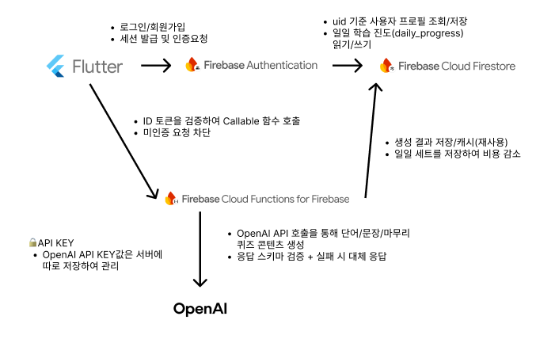


## 화면 구성 및 상세 구현

스크린샷은 `docs/images/screens/`에 저장되어 있으며, 아래 표의 **파일명과 동일**해야 README에 표시됩니다.

| 파일명 | 화면 |
|---|---|
| `첫화면.PNG` | 앱 실행 첫 화면 |
| `알림권한.PNG` / `알림권한2.PNG` | 알림 권한 안내 |
| `로그인방식선택.PNG` | 로그인 방식 선택 |
| `이메일로그인화면.PNG` | 이메일·비밀번호 로그인 |
| `첫실행-로컬언어선택.PNG` | 온보딩 1단계 — 모국어 |
| `첫실행-대상언어선택.PNG` | 온보딩 2단계 — 학습 언어·난이도 |
| `홈화면.PNG` | 홈 탭 |
| `내정보.PNG` | 내 정보 탭 |
| `내정보-언어선택.PNG` | 내 정보 — 학습 언어 변경 |
| `내정보-학습난이도.PNG` | 내 정보 — 학습 난이도 변경 |
| `커뮤니티.PNG` | 커뮤니티 탭 |
| `진행률.PNG` | 진행률 탭 |
| `진행률-날짜클릭.PNG` | 진행률 — 날짜별 상세 |
| `오늘의단어.PNG` | 오늘의 단어 |
| `오늘의문장.PNG` | 오늘의 문장 |
| `오늘의마무리.PNG` | 오늘의 마무리 |
| `기초문자표-영어.PNG` / `기초문자표-한국어.PNG` / `기초문자표-일본어(히라).PNG` | 기초 문자표 (언어별) |

### 1) 앱 진입

| 화면 | 설명 | 스크린샷 |
|---|---|---|
| 첫 화면 | 앱 실행 첫 화면, 터치/자동 전환 후 로그인·홈으로 이동 | 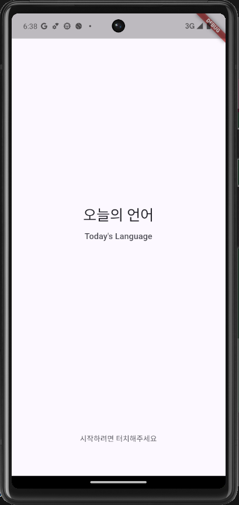 |
| 알림 권한 | 최초 실행 시 알림 허용 안내 | 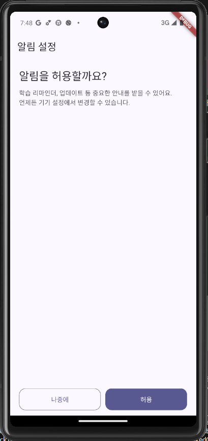 |
| 알림 권한 (거부 후 안내) | 권한 거부·설정 안내 흐름 | 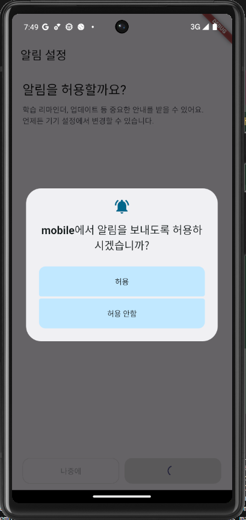 |

### 2) 로그인·회원가입

| 화면 | 설명 | 스크린샷 |
|---|---|---|
| 로그인 방식 선택 | 이메일 로그인 진입 (현재 활성) | 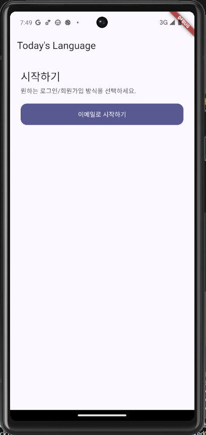 |
| 이메일 로그인 | 이메일·비밀번호 입력 | 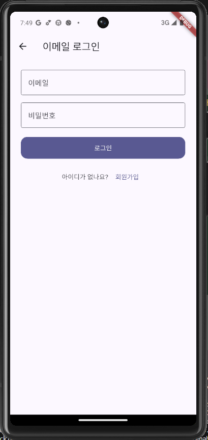 |

> Google·Apple 소셜 로그인은 보안 검토 후 추가 예정 (현재 UI 비활성)

### 3) 온보딩 (첫 진입)

| 화면 | 설명 | 스크린샷 |
|---|---|---|
| 로컬 언어 선택 | 1단계: 모국어 선택 | 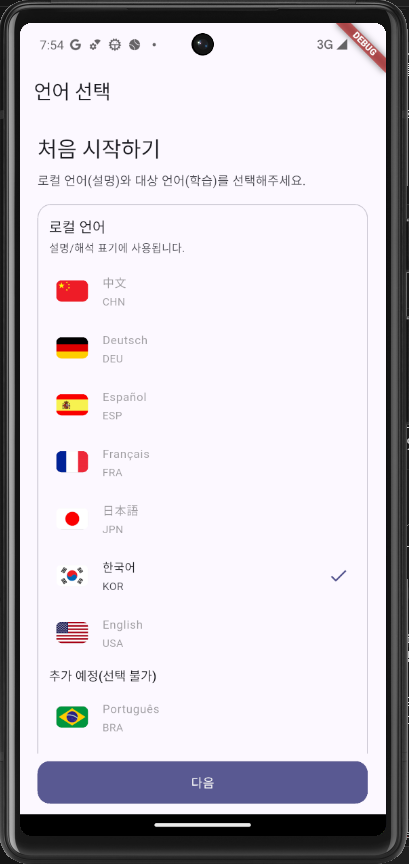 |
| 학습 언어·난이도 | 2단계: 대상 언어·난이도 선택 | 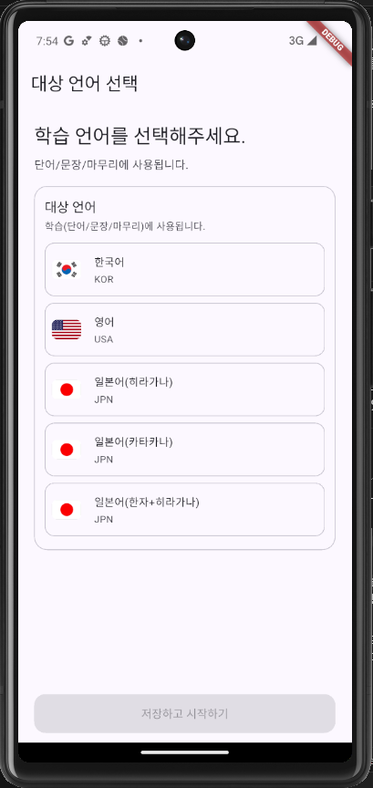 |

### 4) 메인 (하단 탭)

| 화면 | 설명 | 스크린샷 |
|---|---|---|
| 홈 | 오늘의 단어·문장·마무리·기초 문자표 진입, 일일 진행률 요약 | 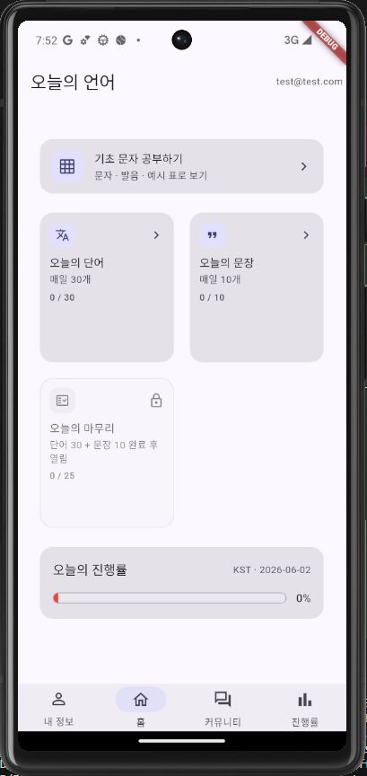 |
| 내 정보 | 학습 언어·난이도 변경, 로그아웃 | 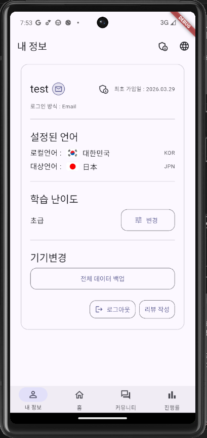 |
| 내 정보 — 언어 선택 | 학습 대상 언어 변경 | 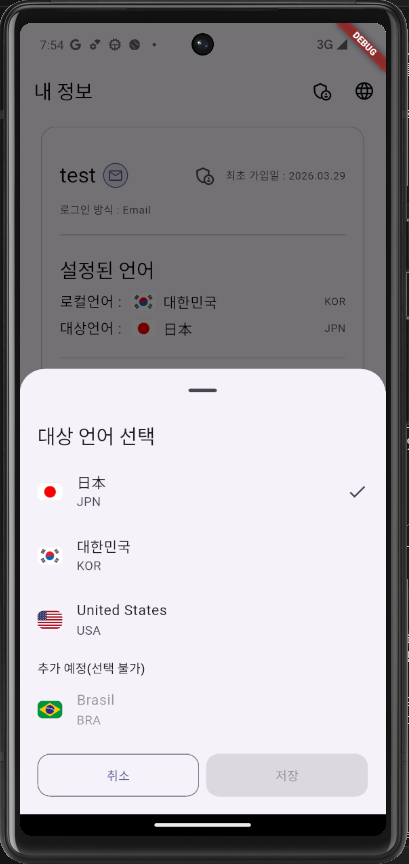 |
| 내 정보 — 학습 난이도 | 난이도 변경 | 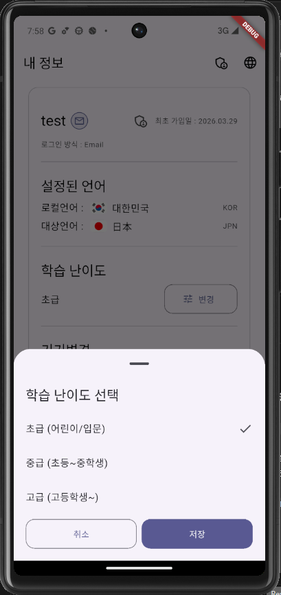 |
| 커뮤니티 | 커뮤니티 탭 (기능 확장 예정) | 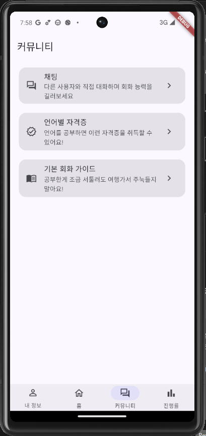 |
| 진행률 | 오늘 진행률·월간 캘린더 | 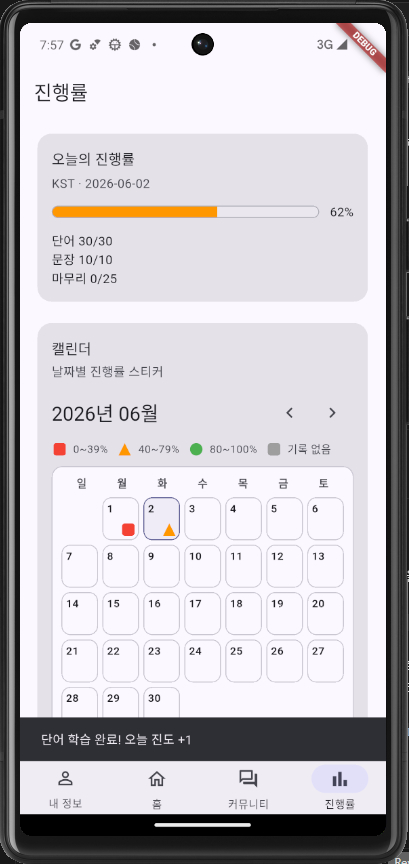 |
| 진행률 — 날짜 상세 | 캘린더 날짜 선택 시 상세 | 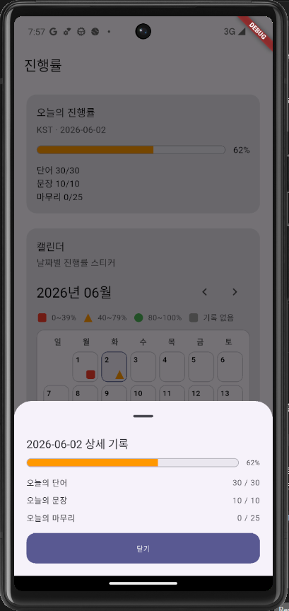 |

### 5) 학습·참고

| 화면 | 설명 | 스크린샷 |
|---|---|---|
| 오늘의 단어 | 일일 단어 30개 학습·예문 | 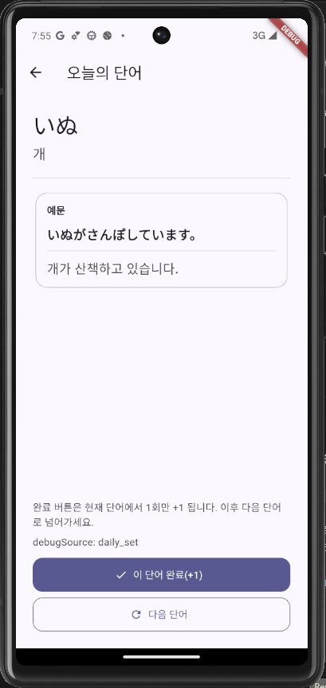 |
| 오늘의 문장 | 일일 문장 10개 학습 | 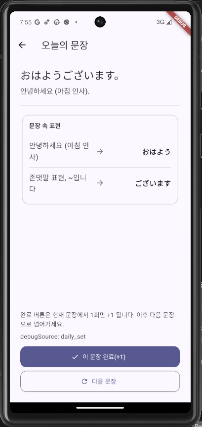 |
| 오늘의 마무리 | 단어·문장 완료 후 4지선다 점검 | 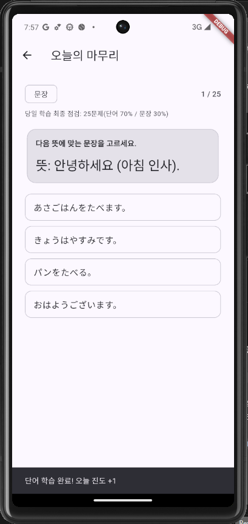 |
| 기초 문자표 (영어) | 알파벳 참고 차트 | 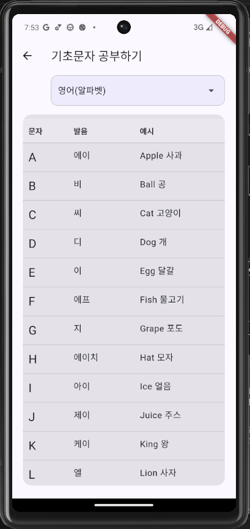 |
| 기초 문자표 (한국어) | 한글 참고 차트 | 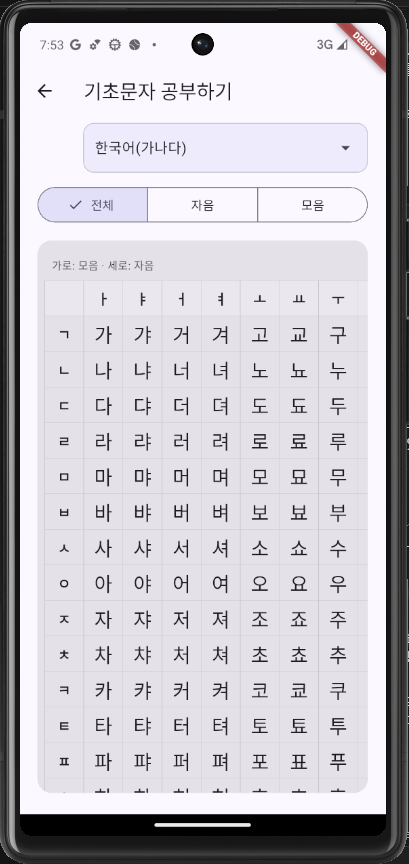 |
| 기초 문자표 (일본어) | 히라가나 참고 차트 |  |

### (미구현) 추후 추가 예정

| 화면 | 설명 | 스크린샷 |
|---|---|---|
| 오늘의 속담 | 한국어 학습 시 속담 학습 | *(스크린샷 미추가)* |
| 이메일 회원가입 | 약관 동의 후 가입 | *(스크린샷 미추가)* |

## 향후 개발 계획


---
- 앱/브랜드 표기: `Today's Language`
- GitHub 리포지토리 이름: `todays-language`
- 목표 플랫폼: Android, iOS (Flutter)
- 백엔드: Firebase (Auth, Firestore, Cloud Functions)


<!-- 
## 기술적 의사결정
### Flutter & Firebase를 선택한 이유
  - 해당 프로젝트는 개인 프로젝트로 비용/효율적인 문제로 "AI를 이용해서 앱을 만들어보고 한번 출시까지 해보자!"라는 어쩌면 터무니없는 생각에서 시작되었다.
  - 선택지중에서는 Flutter / React / Swift + Kotlin 이 있었는데, React는 컴포넌트 구조로 재사용성이 높고 빠른 성능을 갖고있다고 하지만 상태 관리가 복잡하고 여러 API와 도구들을 사용해야 한다는 점이 걸렸다.
  - Swift + Kotlin은 안드로이드와 iOS를 두번 구현해야 한다는 단점이 크게 작용해서, UI - 레이아웃 구현에 최적화 되어있고 안드로이드와 iOS를 동시에 개발할 수 있다는 점을 보고 선택하게 되었다.
  - 최종적으로는 UI 구현의 품질과 이후에 장기 유지보수, 개발 속도를 위해 Flutter를 선택하게 되었다.
  - 데이터베이스로는 AWS나 자체 서버를 생각해보았지만, 설정 난이도가 무겁고 직접 관리해야 했기에 초기 개발속도와 단순성을 보고 Firebase로 선택하게 되었다.


----------------


## 프로젝트 구조

- `app/mobile`: Flutter 앱
- `functions`: Firebase Cloud Functions (추가 예정)
- `docs`: 기획/구현 문서

## 현재 진행 상태

- [x] Flutter 개발 환경 세팅 (Windows)
- [x] Flutter 프로젝트 생성 및 에뮬레이터(Android) 실행 확인
- [x] Firebase 연동
  - Firebase CLI 로그인 후 `flutterfire configure` (프로젝트: `todays-language-dev` 등 콘솔에서 만든 ID)
  - `lib/firebase_options.dart` 생성, `main.dart`에서 `Firebase.initializeApp` 적용
  - 의존성: `firebase_core`, `firebase_auth`, `cloud_firestore`, `cloud_functions`
- [x] Android 빌드 안정화: `gradle.properties`의 JVM 메모리 설정 과다 시 Gradle 데몬 크래시 가능 → 상한 완화
- [ ] Authentication (Email → Google → Apple) — 콘솔에서 제공자 활성화 + 앱 UI
- [ ] Firestore 생성 및 최소 스키마(`docs/FIRESTORE_MIN_SCHEMA.md`) 반영
- [ ] Cloud Functions AI 호출 프로토타입

**Android 패키지명(Firebase 콘솔 등록 시):** `com.todayslanguage.mobile`

## 빠른 시작 (Windows)

```powershell
cd "app/mobile"
flutter pub get
flutter devices
flutter run
# 에뮬레이터만 쓸 때 예: flutter run -d emulator-5554
```

Firebase용 CLI를 쓸 때(한 번): `npm install -g firebase-tools` 후 `firebase login`, 앱 폴더에서 `flutterfire configure`.

## 문서

- 구현 체크리스트: `docs/IMPLEMENTATION_GUIDE.md`
- 프로젝트 컨텍스트: `docs/PROJECT_CONTEXT.md`
- Firestore 최소 스키마: `docs/FIRESTORE_MIN_SCHEMA.md`
- Cloud Functions 프로토타입: `docs/CLOUD_FUNCTIONS_PROTOTYPE.md`
- Notion 기록 템플릿: `docs/NOTION_PROGRESS_TEMPLATE.md`

## 기획 원문 (Notion)

- [Today's Language Notion](https://tabby-smile-a0e.notion.site/32b72820750a80d88ffdda575c5a16b6) -->
